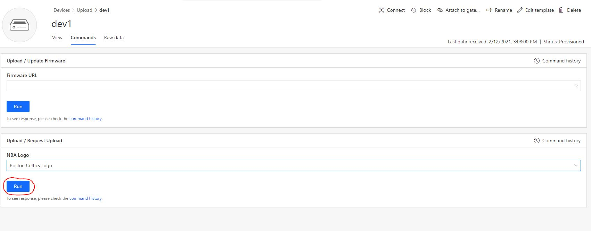
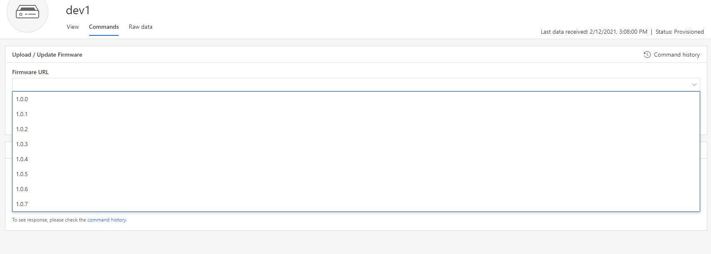
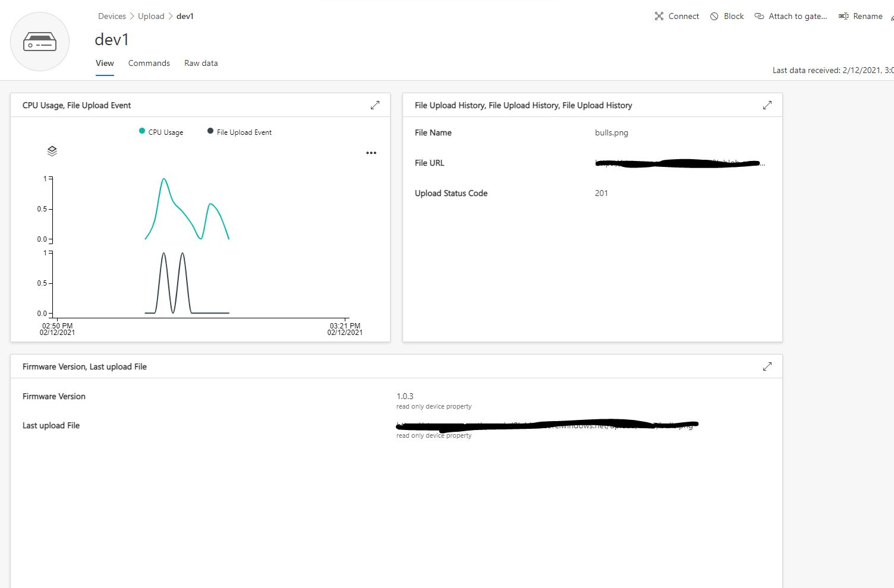

# Azure IoT Central file transfer device sample
This sample demonstrates how to use file transfer capabilities with an IoT Central app. Azure IoT Central takes advantage of the file upload feature of IoT Hub. For file download, this sample shows a common approach for the "firmware update" scenario.

For a full description of the IoT Central File Upload feature see the [documentation online](https://aka.ms/iotcentral-file-upload).
## Prerequisites

- Node.js (12+)
- Azure IoT Central application

## Getting started

### Clone repository and build

```sh
git clone https://github.com/lucadruda/iotc-sample-file-transfer
cd iotc-sample-file
npm install # this will also build code
```

Build can also be triggered with

```sh
npm run build
```

### Prepare IoT Central application

Follow the [instructions](./docs/central_app.md) to create an IoT Central application.

### Setup device credentials

Create a file named "_env.json_" in the root folder with this format:

```json
{
  "deviceId": "<Id of device>",
  "scopeId": "<Scope Id>",
  "groupKey": "<Application SAS Key>",
  "deviceKey": "<Device SAS Key>",
  "modelId": "<Device Template Id>"
}
```

Either use one of "_groupKey_" and "_deviceKey_". When "_deviceKey_" is specified, client will connect to the registered device in IoT Central application. If only "_gropKey_" is specified client will provision a new device with the id in "_deviceId_" and assign it to the device template identified by "_modelId_" above.

### Run sample

From root folder run:

```sh
npm run start
```

## File transfers

### Requesting file upload

This repository contains an "_uploads_" folder that contains some sample images to upload from device.
File are named based on device capability model ([Upload.json](./Upload.json)) parameters.
Select a file to upload and hit "Run".



### Simulate firmware update

When a firmware update request is received, the new firmware gets downloaded into the "_downloads_" folder and device restarts.
The current firmware version gets saved in the "_store.txt_" file and sent to IoT Central when device starts or reboots.



Current device firmware along with file upload history can be seen in a dashboard like the below one.


