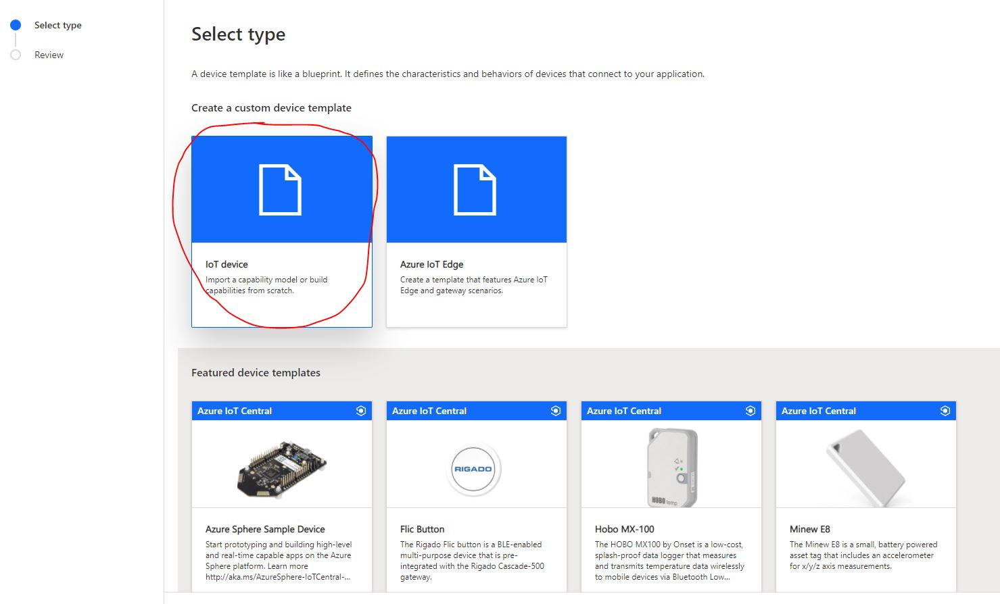
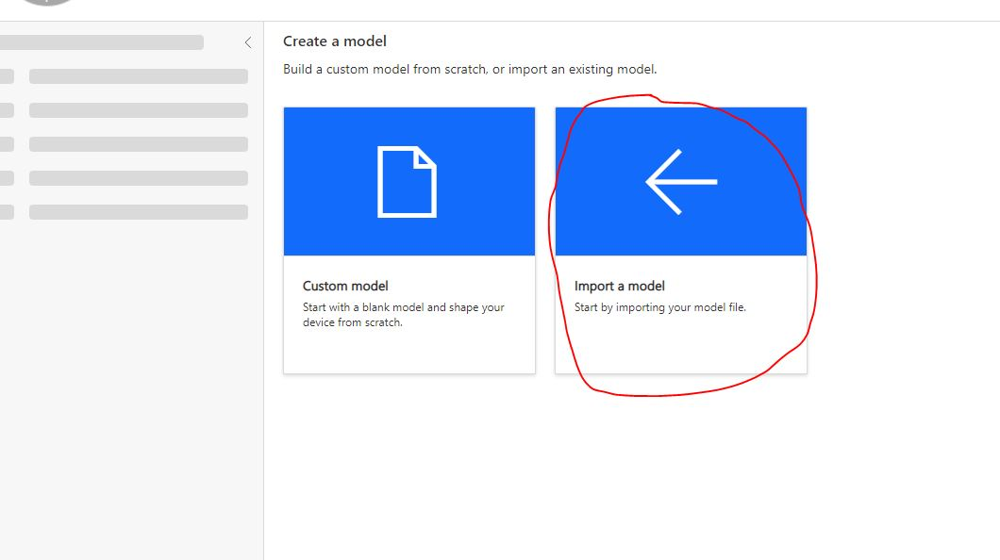
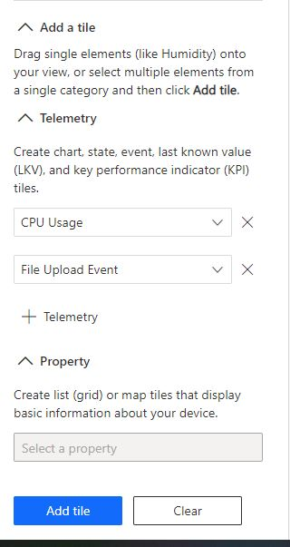

# Prepare an Azure IoT Central application for the sample

Follow the instructions below to create an IoT Central application and associate the application with your Azure Storage account. Create a new device template using the included file upload device sample template.

- Create a new application from [here](https://apps.azureiotcentral.com/build) or grab an existing one.
- From the left pane in your IoT Central Application select "Device templates"
  At the top of the device templates view select the "+ New" option to create a new template
- Select the "IoT Device" option and click the "Next: Customize" button at the bottom of the page
  

- Name your template (e.g. File Upload Device Sample)
- Select the "Next: Review" button
- Select the "Create" button
- Select the "Import capability model" option. The device template is included in the repository at [Upload.json](../Upload.json).
  
  After importing the device template you need to create a view on the telemetry and properties the device will send and receive. See the documentation to Create and manage dashboards in IoT Central. Create a dashboard view for Visualizing the device

- In your new device template select the "Views" option
- Select the "Visualize the device" option
- Select telemetries and properties to show and select "Add tile" to add them to the current dashboard.
  e.g. select "CPU Usage" and "File Upload Event" telemetries and add tile to show these two values in a chart.
  
  Select properties to also add property views to the dashboard. Commands dashboard will be automatically created.
- Select the "Save" option for this view.

Now publish the template by selecting the "Publish" option at the top of the screen. You are now ready to create a device and run the sample code.

## Associate Azure Storage Account to IoT Central application
Follow official [instructions](https://aka.ms/iotcentral-file-upload) to setup your storage account for device file upload. You must have _Administration_ permissions to the IoT Central application in order to setup storage.